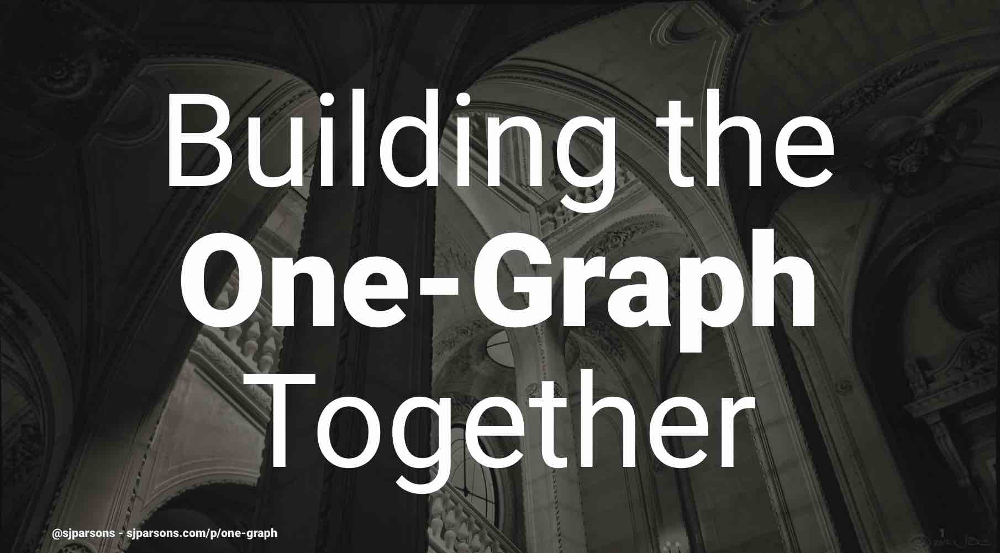

SAP Concur is moving from multiple graphs to a unified graph and one of the greatest challenges we faced is the coordination needed between dozens of teams and product areas. I'll share the practices we used to strike a balance between creating a coherent graph and moving quickly.

<figure>
    <a href="one-graph.pdf">
    <figcaption>Slides for <em>Building the One-Graph Together</em></figcaption></a>
</figure>

### Further reading

- [Principled GraphQL](https://principledgraphql.com/)
- [Continuous Evolution of GraphQL Schemas @ Github](https://speakerdeck.com/xuorig/continuous-evolution-of-graphql-schemas-at-github?slide=39) by Marc-André Giroux
- [GraphQL Schema Design: Building Evolvable Schemas](https://blog.apollographql.com/graphql-schema-design-building-evolvable-schemas-1501f3c59ed5) by Marc-André Giroux
- [Evolving the Graph](https://medium.com/coursera-engineering/evolving-the-graph-4c587a4ad9a8) by Jon Wong